# Sistema Gestor de Materias y Horarios
Este sistema, como su nombre lo indica, permite gestionar los horarios y las materias de los grupos de todas las carreras en el Instituto Tecnológico de León.
Para lo anterior, existen distintos roles con sus respectivos permisos, los cuales son los siguientes: 
* **Administrador.** Puede gestionar las carreras.
* **Jefe o jefe-maestro.** Puede gestionar las materias y los horarios de las carreras en las que es jefe.
* **Maestro.** Puede consultar sus horarios y su perfil.

Este es el proyecto final de la materia "Programación Web Avanzada" y fue realizado utilizando el patrón MVC (Modelo, Vista, Controlador), Java Servlets, Java Beans y JSP.

## Índice 
* [Contenido del proyecto](#contenido-del-proyecto)
* [Vista previa](#vista-previa)
  * [Inicio](#inicio)
  * [Inicio de sesión](#inicio-de-sesión)
  * [Administrador](#administrador)
    * [Módulo de Carreras](#módulo-de-carreras)
    * [Lista de maestros por carrera](#lista-de-maestros-por-carrera)
  * [Maestro](#maestro)
    * [Reporte de materias](#reporte-de-materias)
    * [Perfil](#perfil)
  * [Jefe](#jefe)
    * [Seleccionar una carrera](#seleccionar-una-carrera)
    * [Módulo de materias](#módulo-de-materias)
    * [Módulo de maestros](#módulo-de-maestros)
    * [Reporte de un maestro](#reporte-de-un-maestro)
    * [Sábana de horarios](#sábana-de-horarios)
    * [Detalle de un horario](#detalle-de-un-horario)
* [Cómo clonar el proyecto](#cómo-clonar-el-proyecto)
* [Instalación](#instalación)
  * [Prerrequisitos](#prerrequisitos)
  * [Pasos a seguir](#pasos-a-seguir)
  * [Utilizando Docker](#utilizando-docker)
* [Acceso al sistema](#acceso-al-sistema)
* [Notas](#notas)

## Contenido del proyecto
El proyecto solo cuenta con una rama (master) y dentro de ella tiene las siguientes carpetas:
```
📂proyectoMVC/
  📂src/
    📂controlador/
      📄...
    📂javabeans/
      📄...
    📂modelo/
      📄...
  📂baseDatos/
    📄inserts.sql
    📄scriptBd.sql
  📂archivosDocker/
    📄Dockerfile-mysql
    📄Dockerfile-tomcat
  📂WebContent/
    📂css/
      📄...
    📂img/
      🖼️...
    📂js/
      📄...
    📂META-INF/
    📂WEB-INF/
    📄...
  ...
```
Siguiendo la estructura de MVC:
* **src/controlador/** -> Contiene todos los servlets que actúan como controladores.
* **src/modelo/ y src/javabeans/** -> Contienen todas las clases que actúan como modelos.
* **WebContent/** -> Contiene todos los JSP que actúan como vistas.

## Vista previa
El sistema cuenta con las siguientes vistas y módulos.
### Inicio

### Inicio de sesión
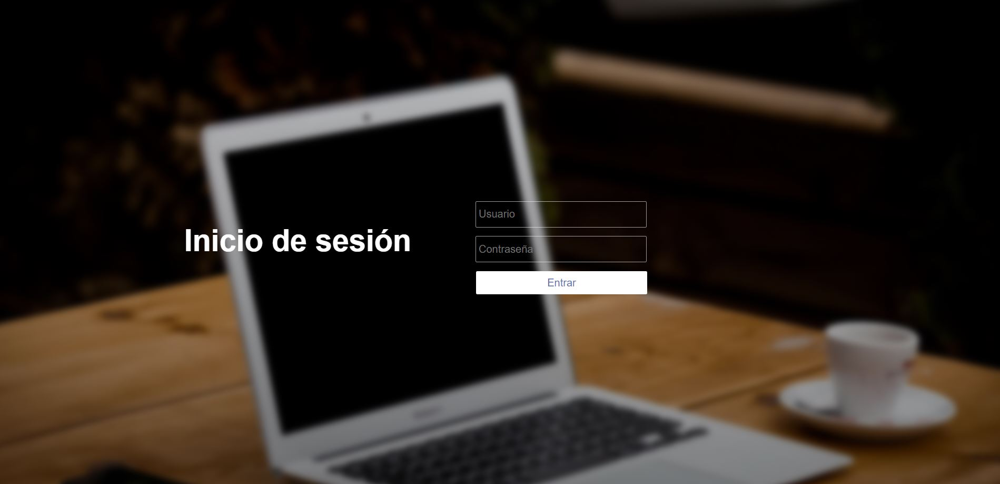
### Administrador
#### Módulo de Carreras
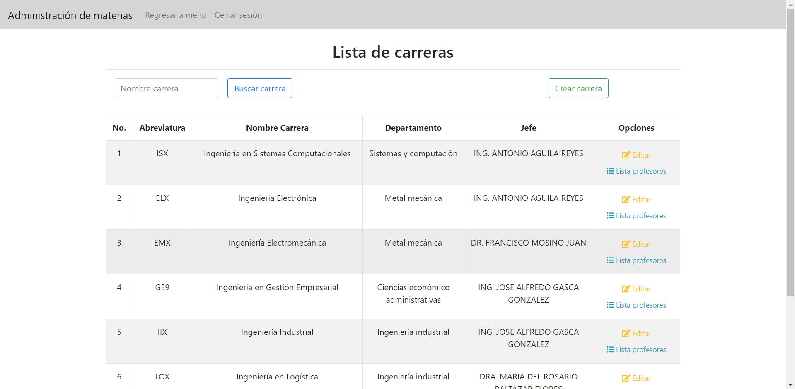
#### Lista de maestros por carrera
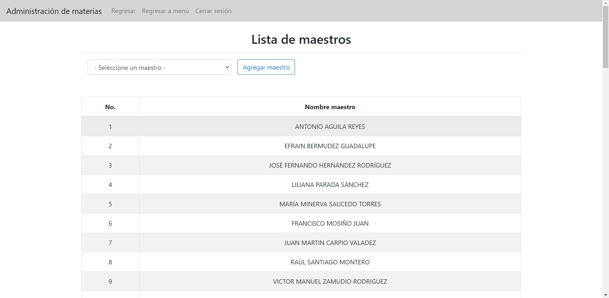
### Maestro
#### Reporte de materias
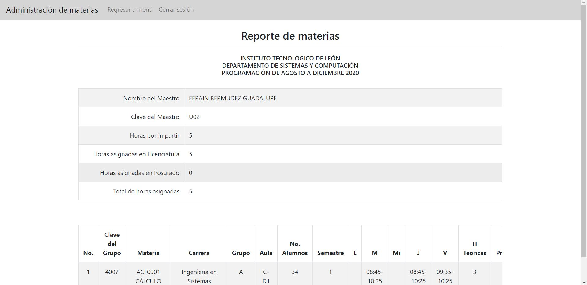
#### Perfil 
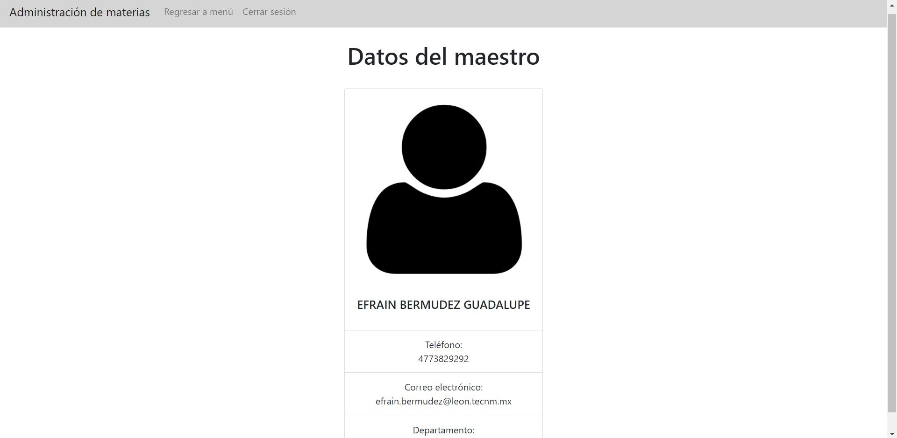
### Jefe
#### Seleccionar una carrera
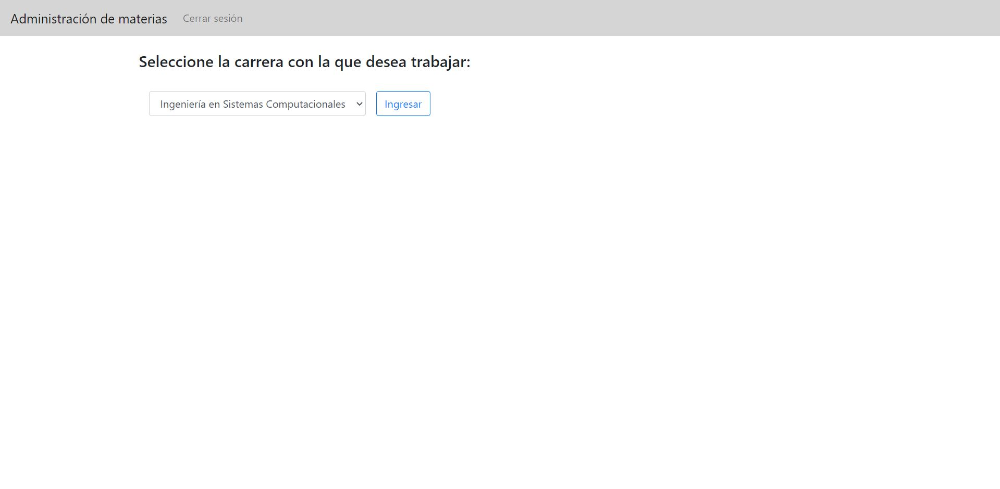
#### Módulo de materias
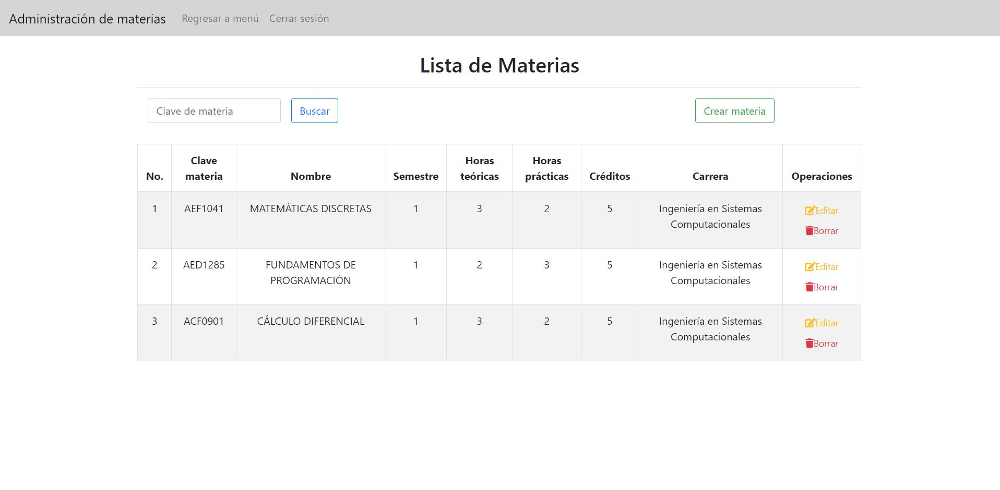
#### Módulo de maestros
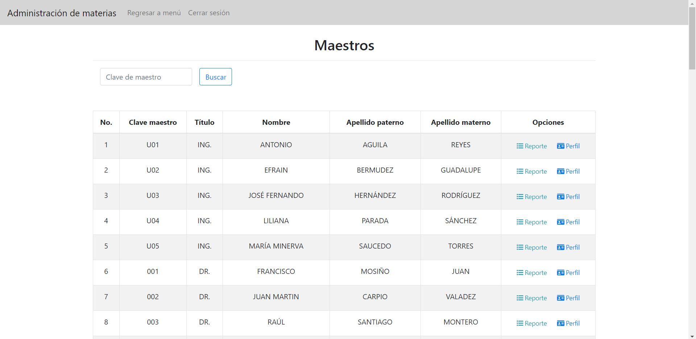
#### Reporte de un maestro
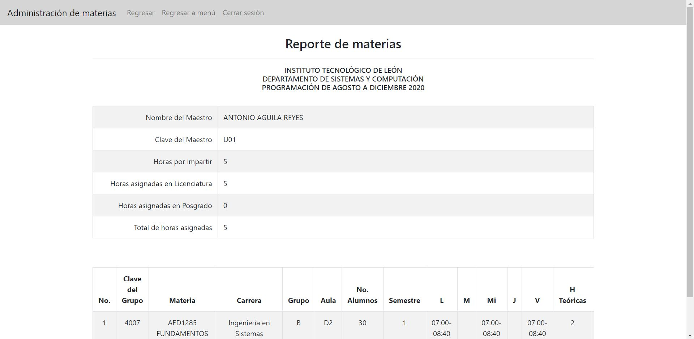
#### Sábana de horarios
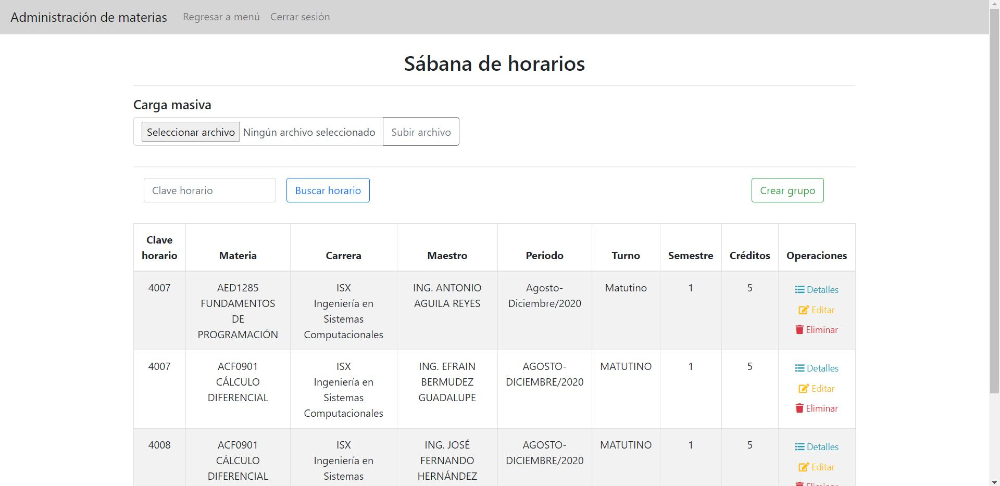
#### Detalle de un horario
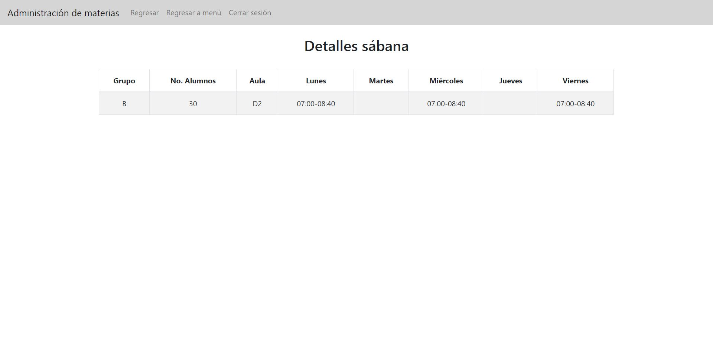

## Cómo clonar el proyecto
Para clonar el proyecto en tu computadora deberás de seguir los siguientes pasos:
1. Seleccionar la carpeta en la que deseas almacenar el proyecto.
2. Abrir git bash y escribir el siguiente comando:
```
git clone https://github.com/LiLiPS/proyectoMVC.git
```
**¡Listo!🎉 Ya tendrás los documentos que conforman el proyecto en tu computadora.**

## Instalación
### Prerrequisitos
Para poder instalar el proyecto, se debe de contar con lo siguiente:
* Un IDE de tu preferencia. (El proyecto fue desarrollado y probado en el [IDE Eclipse](https://www.eclipse.org/downloads/packages/release/2020-09/r/eclipse-ide-enterprise-java-developers)).
* [XAMPP](https://www.apachefriends.org/es/download.html) que contiene un servidor MySQL que permitirá gestionar la base de datos.
* El servidor  web [Apache Tomcat](https://tomcat.apache.org/download-90.cgi).
* Si deseas ejecutar el proyecto utilizando contenedores, deberás instalar [Docker](https://www.docker.com/products/docker-desktop).

### Pasos a seguir
Después de instalar lo que se mencionó anteriormente y de [clonar el proyecto](#cómo-clonar-el-proyecto) en tu computadora, se deben se seguir los siguientes pasos:

1. Abrir el proyecto en el IDE.
2. Iniciar el servidor Tomcat, ya sea desde el IDE o desde la línea de comandos con el siguiente comando:
```
startup.bat
```
3. Iniciar el servicio de MySQL y de Apache desde XAMPP.
4. Entrar al gestor de base de datos que incluye XAMPP llamado "phpMyAdmin". Crear una nueva base de datos con el nombre "proyectomvc" e importar el archivo [proyectomvc_vf.sql](ProyectoMVC/baseDatos/proyectomvc_vf.sql).
5. Ejecutar el proyecto. 

**¡Listo!🎉 Ya podrás acceder al sistema**

*NOTA*: Si utilizas Eclipse para correr el proyecto, no necesitas realizar el paso 2. Simplemente das clic derecho en el nombre del proyecto y eliges la opción "Run as", y
posteriormente "Run on Server". Eso iniciará el servidor Apache Tomcat y ejecutará tu proyecto.

### Utilizando Docker
También podrás correr el proyecto utilizando Docker, lo cual permite que accedas al sistema sin la necesidad de instalar los servidores Tomcat y MySQL, ya que están dentro de los contenedores. 

Para correr el proyecto con Docker se deben de seguir los siguientes pasos:
* Clonar las siguientes imágenes:
  * https://hub.docker.com/r/lilips/tomcatmvc
  * https://hub.docker.com/r/lilips/mysqlmvc
* Desde la línea de comandos, escribe el siguiente comando:
```
docker-compose up
```
Este permitirá que se ejecute el documento [docker-compose.yml](ProyectoMVC/docker-compose.yml). 
* Una vez terminada la ejecución estarán corriendo los servidores de Apache Tomcat y de MySQL.
* En un navegador ingresa a: localhost:8080/ProyectoMVC

**¡Listo!🎉 Ya podrás utilizar el proyecto**

## Acceso al sistema 
Para poder acceder al sistema se cuenta con los siguientes usuarios y contraseñas:
```
~ Administrador ~
👤 lparada060
🔐 1234
```
```
~ Jefe de carrera ~
👤 aaguila015
🔐 1234
```
```
~ Maestro ~
👤 ebermudez014
🔐 1234
```
Para encontrar más usuarios con los que ingresar al sistema, consulta el documento de registros a la base de datos: 
[Registros](ProyectoMVC/baseDatos/inserts.sql)

### Notas
Elaborado por: Liliana Parada Sánchez
