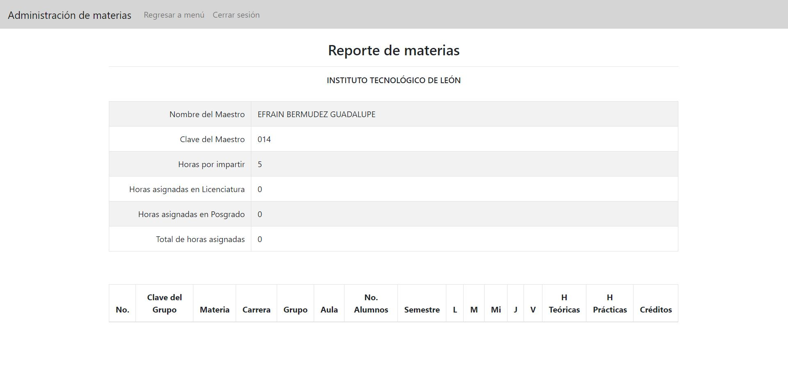
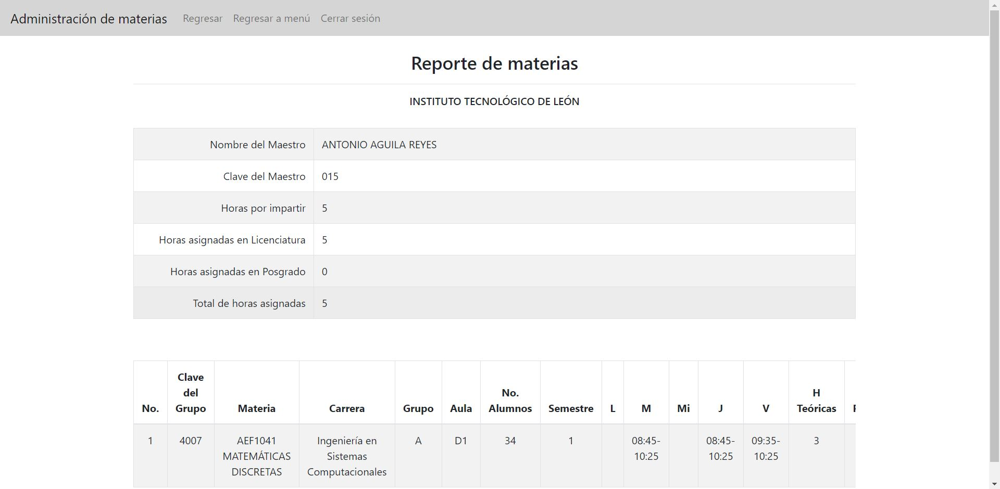

# Sistema Gestor de Materias y Horarios
Este sistema, como su nombre lo dice, permite gestionar los horarios y las materias de los grupos de todas las carreras en el Instituto Tecnológico de León.
Para lo anterior, existen distintos roles con sus respectivos permisos, los cuales son los siguientes: 
* **Administrador.** Puede gestionar las carreras.
* **Jefe o jefe-maestro.** Puede gestionar las materias y los horarios de las carreras en las que es jefe.
* **Maestro.** Puede consultar sus horarios y su perfil.

Este es el proyecto final de la materia "Programación Web Avanzada" y fue realizado utilizando el patrón MVC (Modelo, Vista, Controlador), Java Servlets, Java Beans y JSP.

## Índice 
* [Contenido del proyecto](#contenido-del-proyecto)
* [Demo](#demo)
  * [Inicio](#inicio)
  * [Inicio de sesión](#inicio-de-sesión)
  * [Administrador](#administrador)
    * [Módulo de Carreras](#módulo-de-carreras)
    * [Lista de maestros por carrera](#lista-de-maestros-por-carrera)
  * [Maestro](#maestro)
    * [Reporte de materias](#reporte-de-materias)
    * [Perfil](#perfil)
  * [Jefe](#jefe)
    * [Seleccionar una carrera](#seleccionar-una-carrera)
    * [Módulo de materias](#módulo-de-materias)
    * [Módulo de maestros](#módulo-de-maestros)
    * [Reporte de un maestro](#reporte-de-un-maestro)
    * [Sábana de horarios](#sábana-de-horarios)
    * [Detalle de un horario](#detalle-de-un-horario)
* [Cómo clonar el proyecto](#cómo-clonar-el-proyecto)
* [Instalación](#instalación)
  * [Utilizando Docker](#utilizando-docker)
* [Acceso al sistema](#acceso-al-sistema)
* [Vista previa](#vista-previa)
* [Notas](#notas)

## Contenido del proyecto
El proyecto solo cuenta con una rama (master) y dentro de ella tiene las siguientes carpetas:
```
📂proyectoMVC/
  📂src/
    📂controlador/
      📄...
    📂javabeans/
      📄...
    📂modelo/
      📄...
  📂baseDatos/
    📄inserts.sql
    📄scriptBd.sql
  📂WebContent/
    📂css/
      📄...
    📂img/
      🖼️...
    📂js/
      📄...
    📂META-INF/
    📂WEB-INF/
    📄...
  ...
```
Siguiendo la estructura de MVC:
* **src/controlador/** -> Contiene todos los servlets que actúan como controladores.
* **src/modelo/ y src/javabeans/** -> Contienen todas las clases que actúan como modelos.
* **WebContent/** -> Contiene todos los JSP que actúan como vistas.

## Demo
El sistema cuenta con las siguientes vistas y módulos.
### Inicio

### Inicio de sesión

### Administrador
#### Módulo de Carreras

#### Lista de maestros por carrera

### Maestro
#### Reporte de materias

#### Perfil 

### Jefe
#### Seleccionar una carrera

#### Módulo de materias

#### Módulo de maestros

#### Reporte de un maestro

#### Sábana de horarios

#### Detalle de un horario


## Cómo clonar el proyecto

## Instalación

### Utilizando Docker

## Acceso al sistema 
Para poder acceder al sistema se cuenta con los siguientes usuarios y contraseñas:
```
~ Administrador ~
👤 lparada060
🔐 1234

~ Jefe de carrera ~
👤 aaguila015
🔐 1234

~ Maestro ~
👤 ebermudez014
🔐 1234
```
Para encontrar más usuarios con los que ingresar al sistema, consulta el documento de registros a la base de datos: 
[Registros](ProyectoMVC/baseDatos/inserts.sql)

## Vista Previa

### Notas
Elaborado por: Liliana Parada Sánchez
